<picture>
  <source media="(prefers-color-scheme: dark)" srcset="./assets/banner-dark.svg" />
  <source media="(prefers-color-scheme: light)" srcset="./assets/banner-light.svg" />
  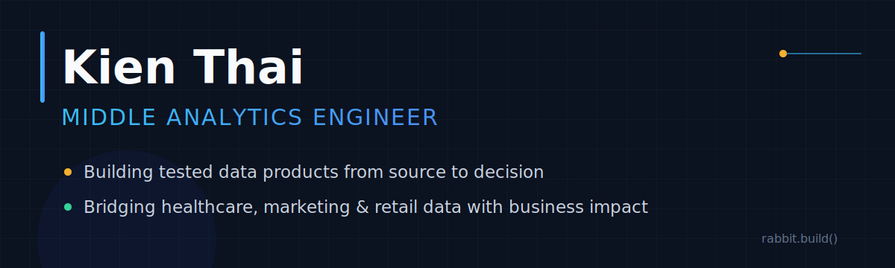
</picture>

<p align="center">
  
</p>

<p align="center">
  <a href="mailto:kienthai2711@gmail.com"></a>&nbsp;
  <a href="https://www.linkedin.com/in/trungkienthai2711/"></a>&nbsp;
  <a href="https://kina2711.github.io/thaikien_data_analytics_engineer/"></a>
</p>

<h2 align="center">I build tested data products from raw operational data to trusted business decisions.</h2>

<p align="center">
  
  
  
  
</p>


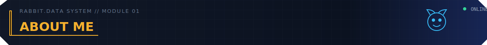

```yaml
rabbit.data_lab:
  operator: "Thai Trung Kien // Rabbit"
  journey: "Pharmacy → Data Analysis → Analytics Engineering"
  mission: "Compile fragmented operations into trusted, decision-ready data products."
  operating_model:
    diagnose: "Define the decision, metric grain and source of truth"
    engineer: "Build batch/CDC pipelines, dimensional models and semantic layers"
    validate: "Enforce contracts, reconciliation, automated tests and observability"
    serve: "Deliver governed metrics to BI, applications and business teams"
  capabilities:
    analytics: "Journeys · Funnels · KPIs · Healthcare · Marketing · Retail"
    analytics_engineering: "dbt · SQL · Semantic Layer · Data Contracts · BI"
    data_engineering: "Kafka · Debezium · Spark · Airflow · Docker · Kubernetes"
  quality_policy: "No metric ships without lineage, ownership and a passing test."
```


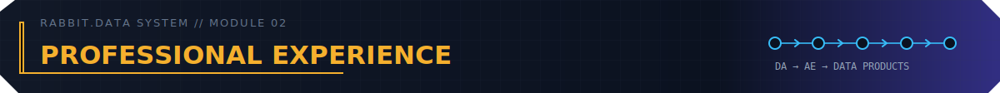

<div align="center">
  <table width="100%">
    <tr>
      <td align="center" valign="top" width="18%">
        <sub>Jan 2025 – Jul 2025</sub><br /><br />
        <br /><br />
        <b>Phuong Dong Hospital</b><br />
        <sub>Data Analyst</sub>
      </td>
      <td align="center" valign="middle" width="2%">➜</td>
      <td align="center" valign="top" width="18%">
        <sub>Apr 2025 – </sub><br /><br />
        <picture>
          <source media="(prefers-color-scheme: dark)" srcset="./assets/experience/xom-data-dark.webp" />
          <source media="(prefers-color-scheme: light)" srcset="./assets/experience/xom-data-light.webp" />
          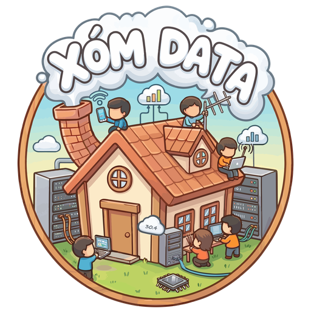
        </picture><br /><br />
        <a href="https://www.facebook.com/xomdata"><b>Xóm Data</b></a><br />
        <sub>Moderator &amp; Admin</sub>
      </td>
      <td align="center" valign="middle" width="2%">➜</td>
      <td align="center" valign="top" width="18%">
        <sub>May 2025 – Jul 2025</sub><br /><br />
        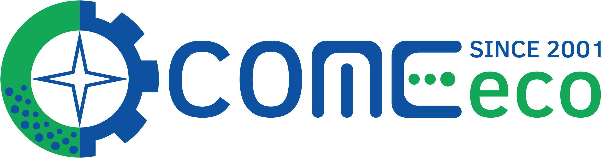<br /><br />
        <b>COMEeco</b><br />
        <sub>BI Developer &amp; Excel Trainer</sub>
      </td>
      <td align="center" valign="middle" width="2%">➜</td>
      <td align="center" valign="top" width="18%">
        <sub>Sep 2025 – Nov 2025</sub><br /><br />
        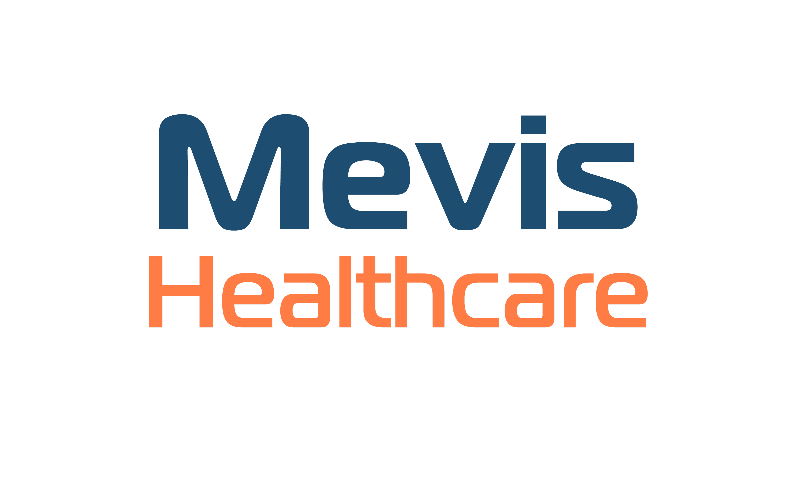<br /><br />
        <b>Mevis Healthcare</b><br />
        <sub>Analytics Engineer</sub>
      </td>
      <td align="center" valign="middle" width="2%">➜</td>
      <td align="center" valign="top" width="18%">
        <sub>Nov 2025 – </sub><br /><br />
        <br /><br />
        <b>VMT Holdings</b><br />
        <sub>Data Analytics Engineer</sub>
      </td>
    </tr>
  </table>
</div>

<p align="center"><sub>Parallel roles reflect concurrent community and project-based work.</sub></p>


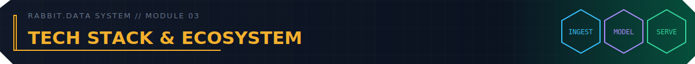

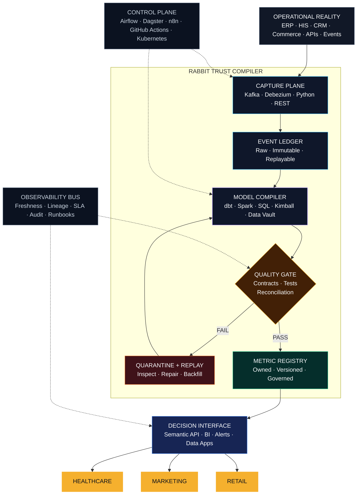

<div align="center">
  <table width="100%">
    <tr>
      <td width="24%"><b>📥 Ingest &amp; Streaming</b></td>
      <td width="76%">
        
        
        
        
        
        
        
      </td>
    </tr>
    <tr>
      <td><b>🛢️ Store &amp; Manage</b></td>
      <td>
        
        
        
        
        
        
        
        
        
      </td>
    </tr>
    <tr>
      <td><b>🔄 Transform &amp; Model</b></td>
      <td>
        
        
        
        
        
        
      </td>
    </tr>
    <tr>
      <td><b>⚙️ Orchestrate &amp; Automate</b></td>
      <td>
        
        
        
      </td>
    </tr>
    <tr>
      <td><b>🛡️ Quality &amp; Governance</b></td>
      <td>
        
        
        
        
        
        
        
      </td>
    </tr>
    <tr>
      <td><b>📊 Semantic &amp; Analytics</b></td>
      <td>
        
        
        
        
        
        
        
      </td>
    </tr>
    <tr>
      <td><b>🚀 Platform &amp; CI/CD</b></td>
      <td>
        
        
        
        
        
        
      </td>
    </tr>
    <tr>
      <td><b>💻 Workbench</b></td>
      <td>
        
        
        
        
        
        
        
        
        
      </td>
    </tr>
  </table>
</div>


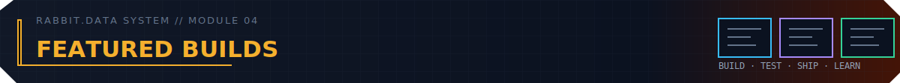

<table>
  <tr>
    <td width="25%" valign="top">
      <a href="https://github.com/kina2711/aerovoice-intelligence-platform">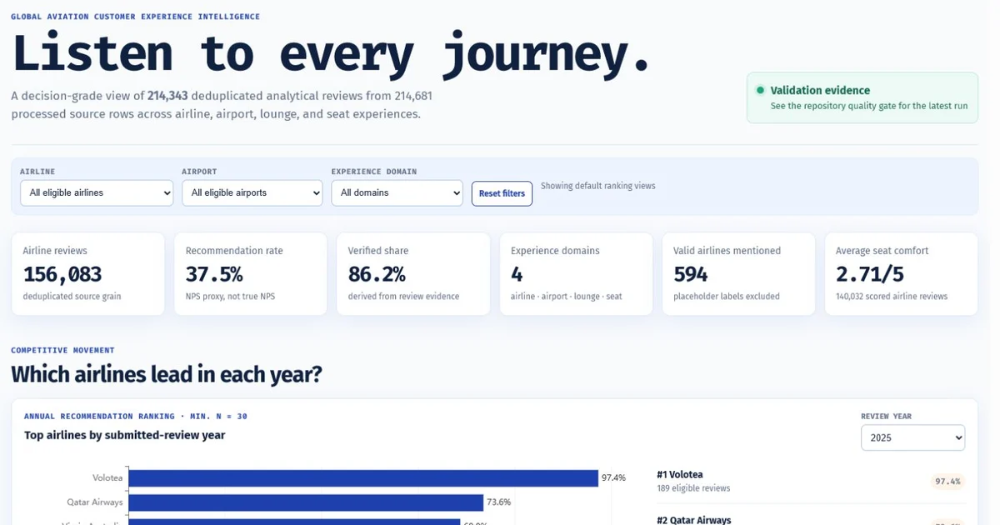</a><br />
      <b>AeroVoice Intelligence</b><br />
      <sub>214,681 reviews · 120 tests · privacy-safe NLP analytics</sub><br /><br />
      <a href="https://github.com/kina2711/aerovoice-intelligence-platform">Repository</a> · <a href="https://kina2711.github.io/aerovoice-intelligence-platform/">Live</a>
    </td>
    <td width="25%" valign="top">
      <a href="https://github.com/kina2711/green-sm-nyc-mobility-intelligence">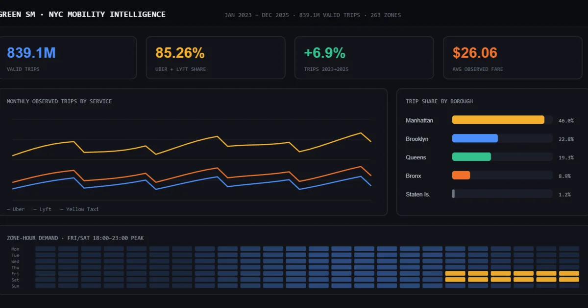</a><br />
      <b>Green SM NYC Mobility</b><br />
      <sub>843.7M rows · 263 zones · 61/61 dbt tests passed</sub><br /><br />
      <a href="https://github.com/kina2711/green-sm-nyc-mobility-intelligence">Repository</a> · <a href="https://kina2711.github.io/green-sm-nyc-mobility-intelligence/">Live</a>
    </td>
    <td width="25%" valign="top">
      <a href="https://github.com/kina2711/velocisync-m2mr-etl">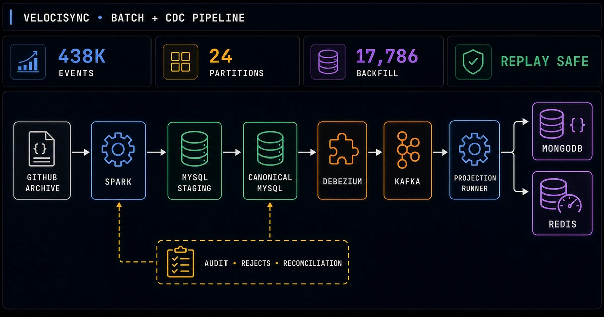</a><br />
      <b>VeloCiSync M2MR</b><br />
      <sub>438K events · replay-safe batch and CDC · dual-target delivery</sub><br /><br />
      <a href="https://github.com/kina2711/velocisync-m2mr-etl">Repository</a>
    </td>
    <td width="25%" valign="top">
      <a href="https://github.com/kina2711/polaris-data-jobs-platform">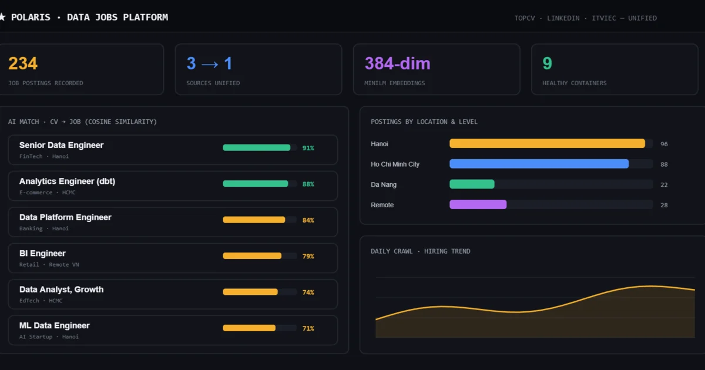</a><br />
      <b>Polaris Data Jobs</b><br />
      <sub>3 sources · 234 jobs · vector matching · scheduled alerts</sub><br /><br />
      <a href="https://github.com/kina2711/polaris-data-jobs-platform">Repository</a>
    </td>
  </tr>
</table>

<p align="right"><a href="https://github.com/kina2711?tab=repositories"><b>Explore all repositories →</b></a></p>

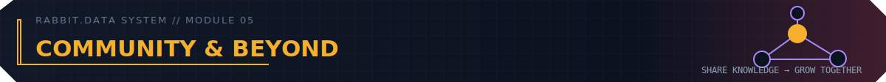

<p align="center">
  🧑‍🤝‍🧑 <b>Moderator &amp; Admin at Xóm Data Vietnam</b> · 100,000+ members<br />
  🧪 Maintaining a free SQL Server practice environment with 14 domain schemas<br />
  🎓 Hanoi University of Pharmacy · Google DA, Advanced DA &amp; BI · HackerRank SQL Advanced
</p>


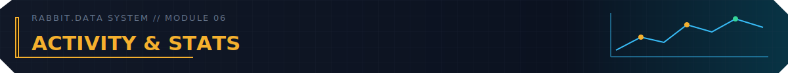


<picture>
  <source media="(prefers-color-scheme: dark)" srcset="https://raw.githubusercontent.com/kina2711/kina2711/output/github-contribution-grid-snake-dark.svg" />
  <source media="(prefers-color-scheme: light)" srcset="https://raw.githubusercontent.com/kina2711/kina2711/output/github-contribution-grid-snake.svg" />
  
</picture>


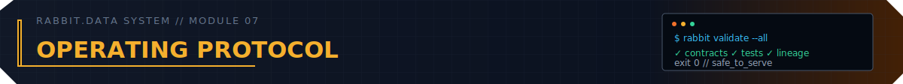

```sql
-- rabbit.rx: evidence before confidence
WITH trusted_evidence AS (
    SELECT metric, value, observed_at, owner
    FROM operational_reality
    WHERE source_is_traceable = TRUE
      AND data_contract_passed = TRUE
      AND reconciliation_delta = 0
)
SELECT metric, value, owner, observed_at
FROM trusted_evidence
WHERE decision_is_actionable = TRUE;
```

<p align="center"><b>Data deserves the discipline of medicine: traceable sources, tested formulas and the right decision at the right time.</b></p>

<picture>
  <source media="(prefers-color-scheme: dark)" srcset="./assets/footer-dark.svg" />
  <source media="(prefers-color-scheme: light)" srcset="./assets/footer-light.svg" />
  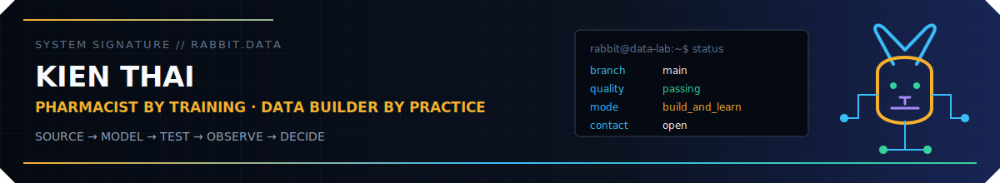
</picture>
